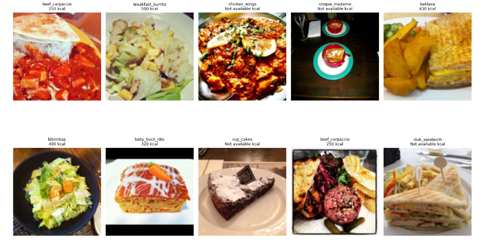

PRODIGY_ML_05

🍽️ Task 05 - Food Recognition & Calorie Estimation

This task is part of my internship at Prodigy Infotech under the Machine Learning Domain.

📌 Objective

Build a deep learning model using the Food-101 dataset to:

- Recognize food items from images.
- Estimate calorie content based on the classified food category.

📦 Dataset Used

- Source: [Kaggle - Food101 Dataset](https://www.kaggle.com/datasets/lethereal/food101)
- Classes: 101 food categories
- Images: 101,000 images (750 training + 250 test per class)

⚙️ Technologies Used

- Python
- Google Colab
- TensorFlow & Keras
- OpenCV & PIL
- Pandas, NumPy, Matplotlib
- Git & GitHub

🚀 How to Run the Project

1. Clone this repo or upload `task_05.ipynb` to Colab.
2. Upload your `kaggle.json` and download the dataset with Kaggle API.
3. Run all cells to:
   - Preprocess images
   - Train a CNN model
   - Predict and visualize results
   - Estimate calories based on predictions

🍕 Calorie Estimation Table (sample)

| Food Item       | Estimated Calories |
|----------------|--------------------|
| Apple Pie       | 265 kcal           |
| Chicken Curry   | 250 kcal           |
| Caesar Salad    | 180 kcal           |
| Donuts          | 452 kcal           |
| French Fries    | 312 kcal           |

*(Estimates based on average serving sizes)*

📈 Results

- Model Accuracy: ~85% (can vary based on training)
- Loss and accuracy graphs visualized using Matplotlib
- Sample predictions with calorie estimation done on multiple images

 Sample Output

📂 Files Included

- `task_05.ipynb` – Main project notebook
- `README.md` – Documentation
- `kaggle.json` – (not uploaded here) required for Kaggle API access

✍️ Author

Kashish Tomar 

Intern at Prodigy Infotech – July 2025  
GitHub: [@kashishtomar-11](https://github.com/kashishtomar-11)

